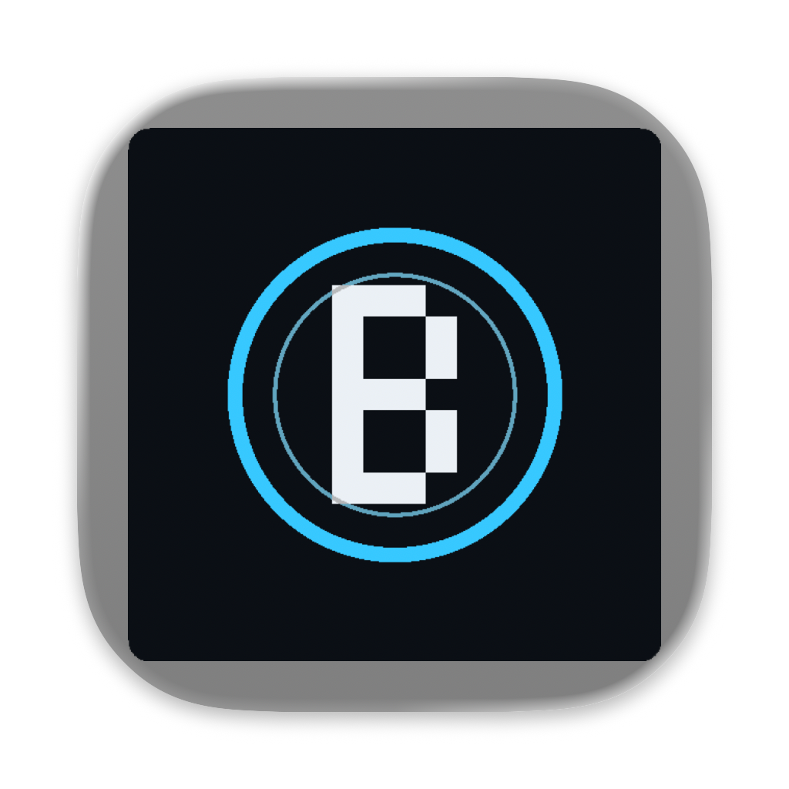

# Backlight · AI 与人协作的后台浏览器

Backlight 是一个面向 AI Agent 与人类共同使用的 macOS 浏览器。AI 可以低干扰地创建和操作网页；需要登录、扫码或人工判断时，用户可以从 Dock 或菜单栏接手同一个浏览器窗口。

项目地址：<https://github.com/insogao/parallel-browser>



## 开发理念

Backlight 关注的是建立清楚的人机控制边界：

- AI 的后台操作不应随意抢焦点、移动用户窗口或覆盖正在输入的内容。
- 人工接手是正常流程。用户应该能直接打开、最大化浏览器，完成登录、扫码和交互，再交还给 Agent。
- 浏览器自动化、扩展开发和人工操作使用同一个受管实例，避免测试环境与真实环境行为不一致。
- 状态应当诚实可观测。健康面板区分原生帧率、逻辑调度和定时器，不伪造 `document.visibilityState`。
- 能力边界必须写清楚。当前原生捕获保活同时覆盖一个目标，不宣称所有后台标签都能保持原生 60fps。

## 功能特点

- **静默打开网页**：默认通过后台 target 创建页面，不展开或移动人工窗口。
- **后台持续加载**：最小化后，多标签页的网络请求和定时轮询可以继续；单个捕获目标可保持原生渲染。
- **人工接手**：`show`、`show --maximize`、Dock 和菜单栏均可恢复受管窗口，用于登录或扫码。
- **最后意图生效**：当 `bg` 与 `show` 并发时，较新的人工操作不会被较早的延迟最小化覆盖。
- **原生扩展侧栏开发**：使用 Chromium `sidePanel`，可以在真实网页旁调试，而不是只查看孤立的扩展页面。
- **定向热重载**：只重载指定的 unpacked 扩展，不重启浏览器，不清空网页草稿和扩展 storage。
- **目标级 DevTools**：网页、原生侧栏和 Service Worker 都可以选择 target 后单独调试。
- **AI 活动可见**：本地 Dashboard 展示运行状态、健康数据、扩展状态和 Agent 指令活动。
- **独立品牌**：应用名称、bundle ID 和图标均与 Google Chrome 区分，使用独立 profile。

## 它不是 Electron 套壳

Backlight 没有使用 Electron，也没有把网页嵌入 Electron `BrowserWindow`。

运行时由三部分组成：

1. **品牌化 Chromium 应用**负责真实网页、登录态、扩展和 DevTools。
2. **Node.js/TypeScript 监督器**负责启动 Chromium、CDP 代理、后台 target、窗口状态、捕获保活和开发 API。
3. **Swift/AppKit 原生组件**负责菜单栏、应用隐藏/恢复、激活和 Dock 重开路由。

```text
AI / Playwright / CLI
          │
          ▼
Node.js 监督器与 CDP 代理（127.0.0.1:9333）
          │
          ├── Chromium DevTools Protocol
          ▼
品牌化 Backlight.app（Chromium）
          ▲
          │
Swift/AppKit 托盘与原生窗口控制
```

这种方案保留 Chromium 原生扩展、登录、sidePanel 和 DevTools 行为，同时允许监督器约束 AI 对窗口的干扰。项目不会对 Chromium 深度重签名，以免破坏 macOS 上的 JIT 权限。

## 快速开始

当前支持 macOS。开发环境需要 pnpm、支持原生 TypeScript 的 Node.js（当前验证 Node 25）和 Xcode/Swift 命令行工具。

```bash
git clone https://github.com/insogao/parallel-browser.git
cd parallel-browser
pnpm install

alias bl="node $PWD/packages/cli/bin/backlight.js"
bl brand --name Backlight
bl launcher install              # 安装/刷新 Launchpad 入口 ~/Applications/Backlight.app
bl launch https://example.com
```

常用命令：

```bash
bl open https://example.org      # 静默创建后台页面
bl show                          # 进入人工接手
bl show --maximize               # 恢复并最大化
bl login                         # 启动台入口的同一路径：确保 daemon/品牌引擎并最大化接管
bl bg                            # 最小化并隐藏，继续后台任务
bl status
bl health
bl windows
bl stop
```

## 启动台入口与人工登录

`bl launcher install` 会安装一个独立的 `~/Applications/Backlight.app`（bundle id `dev.backlight.launcher`，Launchpad 可直接发现），并把运行所需的最小快照安装到 `~/Library/Application Support/Backlight/runtime/`。它**不是**隐藏引擎 app 的副本：点击后执行 `bl login` 的同一路径，确保 daemon 运行、选中品牌化 Backlight 引擎（bundle id `dev.backlight.browser`，位于 `~/Library/Application Support/Backlight/apps/Backlight.app`），启动或复用受管默认 space/profile，然后显示、最大化并激活受管浏览器。重复点击幂等：已在运行时只 focus/show/maximize，不会产生未受管实例或第二个 daemon；已在运行的异引擎会话不会被终止，点击会明确返回“未接管”并提示先 `bl stop` 再试。安装/刷新使用独立锁串行化，可安全重复执行。

```bash
bl launcher install              # 构建 + 原子替换 + 注册 LaunchServices + 校验
bl launcher status               # 结构/plist/codesign/目标/引擎逐项校验
bl launcher uninstall            # 仅移除入口（--purge 同时删除 runtime 快照）
```

点击日志：`~/Library/Application Support/Backlight/logs/launcher.log`（daemon 日志同目录 `daemon.log`）。源码更新后需要重新执行 `bl launcher install` 刷新 runtime 快照。启动器不依赖当前仓库/worktree 路径，分支合并或 worktree 删除后仍然可用。

> 物理 Launchpad 点击与真实登录体验属于人工验收项；非 GUI 的结构、签名、LaunchServices 索引和单元测试已由项目自检覆盖。

本地 Dashboard 默认位于 <http://127.0.0.1:9333/>。Playwright 等客户端可以连接：

```js
const browser = await chromium.connectOverCDP('http://127.0.0.1:9333')
```

## 扩展侧栏开发

扩展需要在 manifest 中声明 `side_panel.default_path` 和 `sidePanel` 权限。仓库中的 `examples/side-panel/` 演示了读取网页标题、高亮网页元素和保存笔记。

```bash
bl ext add "$PWD/examples/side-panel" --name demo
bl ext dev demo http://127.0.0.1:9333/demo
bl targets
bl inspect <targetId>
bl ext reload demo
bl ext ls
bl ext rm demo
```

`ext dev` 将侧栏显式绑定到目标网页所在的 Chromium window ID。双窗口打开同一个扩展时，开发接口也不会把另一个窗口的侧栏误认为目标侧栏。

保存扩展文件后，Backlight 使用 Chromium 的 `Extensions.loadUnpacked` 定向重载。内容脚本改动后仍需刷新目标网页；面板重开可能丢失内存状态，持久状态应写入 `chrome.storage`。

## BrowserPilot 集成（测试用扩展，无硬耦合）

Backlight 仓库不包含任何 BrowserPilot 专属代码。BrowserPilot 是可独立分发的 Chrome MV3 扩展，这里只是它的通用宿主与 macOS 集成测试场；不得为 BrowserPilot 增加 Backlight 硬依赖，也不得为测试去改 BrowserPilot 的独立分发形态。

- **通用扩展注册表与热加载**：`bl ext add/rm/reload/ls` 管理的注册表持久化为 Backlight home 下的 `extensions.json`；运行时通过 `GET /api/extensions` 返回 `runtime[]`（id/name/version/path/enabled）与最近一次 reload 结果。加载/重载走 Chromium `Extensions.loadUnpacked`，不重启浏览器。2026-09-16 实测 `runtime[0] = { id: nnollghpaggbcdkkgoieneffnlijinio, name: BrowserPilot, version: 0.1.0, enabled: true }`。
- **profile 级 native host**：Chrome 按显式 `--user-data-dir` 在 `<user-data-dir>/NativeMessagingHosts/` 查找用户级 host。当前默认 profile（`~/Library/Application Support/Backlight/spaces/default/profile`）下的 `com.browserpilot.browseragent.json` 指向 BrowserPilot worktree 的 `native-host/dist/host-mac.sh`。定向注册命令（在 BrowserPilot worktree 内执行，`--only-user-data-dir` 只写显式目标，不碰自动发现目录）：
  ```bash
  npm run register-host:mac -- --only-user-data-dir --user-data-dir "$HOME/Library/Application Support/Backlight/spaces/default/profile"
  ```
- **当前默认安装（2026-09-16）**：默认 space 已加载上述 BrowserPilot worktree 的 `dist/`；host 是品牌浏览器进程的直接子进程（实测 pid 14500 ← 浏览器 pid 2810），监听 `127.0.0.1:47001`。注册与连接在未重启浏览器的情况下生效：`npm run client -- ping '{}' --no-launch` 返回 `pong: true`。
- **如何验证**：
  ```bash
  curl -s http://127.0.0.1:9333/api/extensions          # runtime[] 的 id/name/version/enabled
  # BrowserPilot worktree 内（host 离线时只报错，不会拉起浏览器）：
  npm run client -- ping '{}' --no-launch
  npm run client -- list_templates '{}' --no-launch
  ```
- **新 space 的注册缺口**：host 注册按 user-data-dir 精确作用域；将来新增 Backlight space/profile 不会自动获得 host，需要对该 space 的 profile 目录重跑上面的 `--only-user-data-dir` 注册，再由该实例的扩展调用 `connectNative`（注册本身不需要为生效而重启浏览器）。
- **worktree dist 路径脆弱性**：当前扩展加载路径与 host wrapper 都指向 BrowserPilot 功能 worktree 的产物；移动或删除该 worktree 会同时破坏已加载扩展与 host 注册。合并/迁移后需重新 `bl ext add`（或 reload）并按新路径重跑注册。
- 模板库存口径：BrowserPilot 侧只有 3 个编译内置模板（search、gemini-ask、chatgpt-ask）开箱即用，其余 registry 包需运行时 install/sync；Backlight 文档不得把“registry 有包”写成“已安装/已验证”。

## 窗口状态与启动器变更的生效条件

2026-09-16 的窗口状态保活/来源归因、托盘 source 与 `/api/console`、启动器 `LSUIElement` 等修复已通过确定性单元与一次性真机验收；同日更晚的 release-blocker 修复（显式 bg 不再出现 1–3s 瞬时弹出：capture 改为隐藏扩展页 tabCapture + `/api/bg` 可见时 pre-arm，`getDisplayMedia` picker 路径移除）经 `test:window-state`、`test:bg-invisibility` 各隔离真机 PASS（详见 [docs/development/2026-09-16.md](docs/development/2026-09-16.md)）。已安装的 runtime 快照仍可能是旧代码：**应经 `bl launcher install` 刷新后，在用户批准的重启窗口让新 daemon/浏览器生效**；在用户批准的完整重启前，live daemon/tray 仍运行旧内存代码（旧 capture 机制仍有瞬时显隐）。安全升级步骤与人工验收项见当日开发记录的“生效条件与安全步骤”。

## 技术方案与代码路径

| 模块 | 技术选择 | 作用与代码路径 |
| --- | --- | --- |
| 浏览器生命周期 | Node.js、Chromium、CDP | 启动、停止、profile、后台 target：`packages/daemon/src/browser.ts` |
| 品牌化 | Chromium app bundle、plist、icns | 独立名称、bundle ID、运行时图标：`packages/daemon/src/brand.ts` |
| CDP 客户端与代理 | TypeScript、WebSocket | 协议连接、target 标准化、首帧缓冲：`packages/daemon/src/cdp.ts`、`packages/daemon/src/proxy.ts` |
| 后台保活 | 隐藏扩展页 tabCapture、定时器/rAF 调度 | 单目标原生捕获（bg 前 pre-arm、零窗口操作）与回退策略：`packages/daemon/src/capture.ts`、`packages/daemon/src/capture-extension.ts`、`packages/daemon/src/inject.ts` |
| 窗口控制 | CDP Browser domain | 最小化、贴角、恢复、控制代际：`packages/daemon/src/windows.ts` |
| 原生应用控制 | Swift、AppKit | hide/unhide/activate/state：`tools/app-control.swift`、`packages/daemon/src/native.ts` |
| Dock 与菜单栏 | Swift、NSWorkspace | 激活监听、受管实例路由：`packages/tray/main.swift` |
| 启动台入口 | Swift、LaunchServices | 点击经 daemon login 接管、runtime 快照、安装/校验：`packages/launcher/main.swift`、`packages/daemon/src/launcher.ts` |
| 扩展开发 | Chromium Extensions CDP、sidePanel API | 注册、监听、定向重载、侧栏归属：`packages/daemon/src/extensions.ts`、`packages/daemon/src/extension-dev.ts` |
| 用户入口 | Node.js CLI、HTML Dashboard | `packages/cli/`、`packages/daemon/src/proxy.ts`、`demo.html` |
| 验收 | Node test、真实 Backlight.app | `packages/daemon/tests/`、`tests/backlight-fixture.ts` |

完整状态、已验证结论和剩余边界见 [PROJECT_INDEX.md](PROJECT_INDEX.md)。按日期记录的测试证据见 [docs/development/2026-09-16.md](docs/development/2026-09-16.md)（窗口状态/启动器/来源归因）与 [docs/development/2026-09-13.md](docs/development/2026-09-13.md)。

## 开发规范

### 1. 用便宜的 CLI 模型执行，用主控 Agent 把关

复杂任务先写成 `docs/plans/YYYY-MM-DD-*.md`，至少包含目标、已完成项、TODO、禁止事项、验收条件和精确测试命令。主控 Agent 再把独立实现任务交给成本较低的 CLI 子代理，例如：

```bash
opencode run \
  "阅读任务文档，按 TODO 顺序实现、测试、记录并提交；遇到阻塞要留下证据。" \
  --file docs/plans/YYYY-MM-DD-task.md \
  --model opencode-go/deepseek-v4.1-flash \
  --variant max \
  --auto
```

模型名称只是当前可用示例。派发前应使用 `opencode models` 确认实际标识；不要把密钥、cookie 或用户 profile 写入 prompt、日志或仓库。

### 2. 子代理必须在隔离分支和 worktree 工作

- 主控先保存当前检查点，再创建 `codex/` 前缀分支和独立 worktree。
- 子代理不得直接改 `master`/`main`，不得触碰用户正在使用的默认 Backlight daemon。
- 每个逻辑修复单独提交；实验脚本、临时 profile、浏览器副本和 `/tmp` 日志不提交。
- 主控在合并前检查 diff、提交历史、测试证据和残留进程，不能仅接受子代理的“已完成”报告。

### 3. 采用低频定时巡查，不持续消耗主控资源

推荐每 10 分钟检查一次，而不是持续轮询。每次巡查只做四件事：

1. 查看子代理会话、`git status` 和最新提交。
2. 检查测试是否仍在运行、是否卡死、是否启动了错误的浏览器。
3. 对照任务文档判断方向是否偏离；正常则保持安静。
4. 只有在卡死、证据不足或方向错误时发送具体校准指令；全部完成后停止定时任务。

定时巡查不能替代代码复查。本项目曾通过巡查发现并修复：快速 CDP 响应丢失造成的永久等待、原生 hide/show 竞态，以及隐藏窗口“报告已最小化但实际上仍可见”的 macOS 状态差异。

### 4. 浏览器验收只能使用 Backlight

这是项目的硬规则：

- 所有会启动浏览器的测试必须经过 `packages/daemon/tests/backlight-fixture.ts`。
- 夹具只接受已品牌化的 `Backlight.app`，核验 bundle 名称、ID、图标和 executable 摘要；不存在 Google Chrome 或裸 Chrome for Testing 回退。
- 测试使用独立应用副本和临时 profile，不能操作用户标签页、登录态或默认端口 9333。
- GUI 集成测试串行运行并使用 `caffeinate`；日志必须出现 `[Backlight acceptance]` 和实际 `Backlight.app` 路径。
- 物理 Dock 点击没有被自动化时，文档必须明确写“待人工验收”，不能用 API 或 `open -a` 的结果代替。

### 5. 测试、记录、复查后才能交付

```bash
pnpm -r --if-present run check
bash packages/tray/build.sh
pnpm --filter @backlight/daemon test:unit
pnpm --filter @backlight/daemon test:integration
pnpm --filter @backlight/daemon test
git diff --check
```

行为修复先写能复现问题的测试。完成后更新 `PROJECT_INDEX.md` 和当日 `docs/development/` 记录，写明测试环境、结果、失败过程和未完成项。外部子代理的修改还必须由主控独立复查。

## 当前能力边界

- 原生捕获保活同时只覆盖一个目标。其他标签可以继续网络与定时器任务，但不保证全部维持原生 60fps 渲染。
- 角落模式几乎完全离屏时可能没有合成帧，默认 `Page.captureScreenshot` 可能等待；后台截图应依赖 capture keep-alive 或先恢复窗口。
- 系统睡眠、网站自身的后台策略、CSP 和认证流程仍会影响任务。
- 品牌浏览器使用独立登录存储；跨浏览器品牌复制的加密 cookie 不保证可解密。
- 物理鼠标点击 Dock、复杂登录网站与二维码流程仍需要人工体验测试。
- 当前实现面向 macOS；Swift/AppKit 窗口层需要针对其他操作系统重新实现。

## 进一步阅读

- [项目交接索引](PROJECT_INDEX.md)
- [侧栏扩展示例](examples/side-panel/README.md)
- [开发计划](docs/plans/2026-09-13-opencode-completion.md)
- [窗口状态验收计划](docs/plans/2026-09-16-window-state-throttle-acceptance.md)
- [2026-09-16 开发与验收记录](docs/development/2026-09-16.md)
- [首次公开发布记录](docs/development/2026-09-15.md)
- [Chromium Extensions CDP](https://chromedevtools.github.io/devtools-protocol/tot/Extensions/)
- [Chrome sidePanel API](https://developer.chrome.com/docs/extensions/reference/api/sidePanel)
